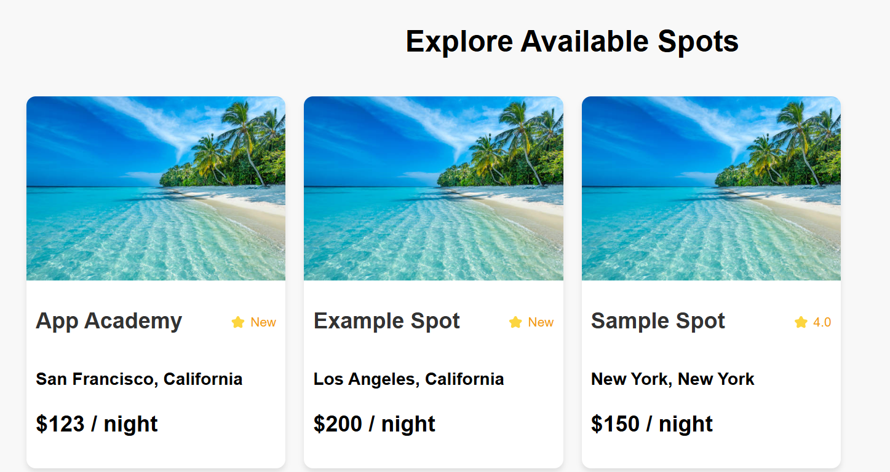

# Spots & Reviews App

## Introduction

The Spots & Reviews App is a full-stack web application that allows users to manage their own "spots" (e.g., properties, locations) and receive feedback in the form of reviews. Users can sign up, log in, create, view, update, and delete spots, as well as add, view, and delete reviews for each spot. This project is a continuation of our previous Express API backend project and now integrates a React frontend with Redux for state management.

## Technologies Used

**Backend:**
- Node.js
- Express.js
- Sequelize ORM
- SQLite3/PostgresQL
- Axios (for API calls)

**Frontend:**
- React
- Redux (with Redux Toolkit)
- React Router
- Axios

**Other Tools:**
- Git & GitHub
- VSCode


## Project Screenshot




## How to Launch the Application Locally

### Prerequisites
- **Node.js** (version 14.x or higher)
- **MySQL Server** installed and running
- **Git** installed

### Setup Instructions

1. **Clone the Repository:**
   ```
   git clone https://github.com/farvastra/auth_me_fullstack.git
   cd frontend


2. **Backend Setup**
The backend of this project is built with Express, Sequelize, and MySQL. Follow these steps to set it up:

**Navigate to the Backend Folder:**
cd backend

**Install Dependencies:**
```
npm install
```

**Configure Environment Variables: Create a .env file in the backend folder with the following content (modify the values as needed):**

NODE_ENV = "development"
PORT = 8000
DB_FILE= db/dev.db
JWT_SECRET= "secret"
JWT_EXPIRES_IN = 7200

**Set Up the Database:**

npx sequelize-cli db:migrate

```
Alternatively, create the database manually and ensure your models are synced.

**Start the Backend Server:**
```
npm start

```

Your Express API should now be running at http:l//localhost:8000

3. **Frontend Setup**

The frontend of this project is built with React and Redux. Follow these steps to set it up:

**Navigate to the Frontend Folder:**
cd ../frontend


**Install Dependencies:**
```
npm install

```

**Start the Frontend Development Server:**
```
npm start

```

Your application should now be accessible at http://localhost:3000.

4. **Running the Full Application**

Once both the backend and frontend servers are running, you can interact with the application locally. Open your browser and navigate to http://localhost:3000 to see the app in action.

